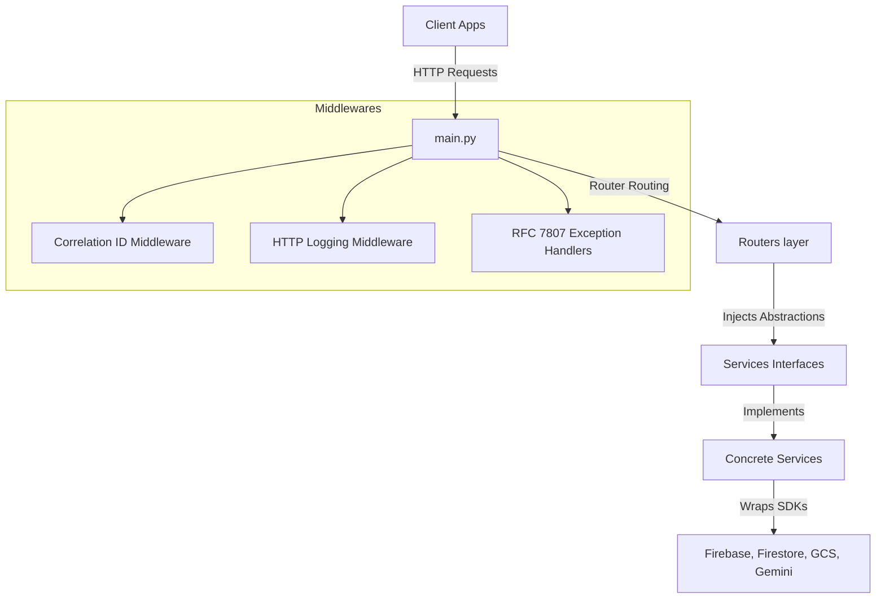

# Project Atlas Backend

An enterprise-ready, modular, and highly performant FastAPI backend architected for scale (target 100,000+ companies). 

This project follows **Clean Architecture** and **SOLID principles**, isolating external dependencies (Firebase Authentication, Cloud Firestore, Google Cloud Storage, Gemini API) behind abstract interfaces. This makes the entire codebase independently testable, highly modular, and prepared for seamless business logic integration.

---

## Architecture Overview



### Core Design Patterns

1. **Dependency Inversion Principle (DIP)**:
   Routers never import concrete service classes directly. Instead, they depend on abstract interfaces (defined in `app/services/base.py`) through FastAPI's dependency injection (`Depends`). This decouples controllers from specific database libraries, API clients, or authentication providers.
   ```python
   # Example: Routers request the interface (IStorageService), not GcsStorageService
   @router.get("/presigned-url")
   async def get_url(storage: IStorageService = Depends(get_storage_service)):
       return await storage.generate_presigned_url(blob_name)
   ```

2. **Single Responsibility & Middleware Separation (SRP)**:
   - **Routers**: Validate request schemas, call service layers, and format responses.
   - **Middlewares**: Capture global concerns (Correlation IDs, request auditing, error translation, and auth injection).
   - **FirebaseAuthMiddleware**: Runs on every incoming request, validates Bearer JWT tokens, and attaches decoded claims to `request.state.user`. Malformed/expired tokens are caught and returned immediately as 401 RFC 7807 problem details.
   - **get_current_user Dependency**: Route-level security dependency that extracts claims directly from `request.state.user` (or falls back to manual validation if middleware is bypassed), enabling clean role verification and OpenAPI spec documentation.
   - **Models**: Standardize data layout definitions (Request, Response, Domain).

3. **Enterprise-Grade Observability**:
   - **Correlation IDs**: Every request is assigned a unique UUID. This correlation ID is automatically injected into all structured logs emitted during the lifecycle of that request and returned in the `X-Correlation-ID` header.
   - **Structured JSON Logging**: Logs are emitted as structured JSON lines when running in `production` for effortless ingestion by tools like Datadog, GCP Logs Explorer, or Elasticsearch.

4. **RFC 7807 Problem Details Error Compliance**:
   All exceptions (validation errors, application failures, uncaught system errors) are translated into standard `application/problem+json` format using global middleware handlers.
   ```json
   {
     "type": "about:blank",
     "title": "Unprocessable Entity",
     "status": 422,
     "detail": "The request body or parameters failed validation requirements.",
     "instance": "/auth/verify",
     "error_code": "VALIDATION_FAILED",
     "correlation_id": "c7110903-8882-4217-ba5d-e2d42df79851",
     "invalid_params": [
       {
         "name": "token",
         "reason": "Field required"
       }
     ]
   }
   ```

---

## Directory Layout

```
Backend/
├── app/
│   ├── main.py                     # App initialisation, middleware binding & routing inclusion
│   ├── config/
│   │   └── settings.py             # Validated configuration parsing via pydantic-settings
│   ├── middleware/
│   │   ├── correlation_id.py       # ID tracking propagation
│   │   ├── error_handler.py        # Exception translation to RFC 7807 response
│   │   ├── logging_middleware.py   # Request latency & status auditing
│   │   └── auth_middleware.py      # JWT session interception middleware & guard dependency
│   ├── models/
│   │   ├── domain/                 # Database representation schemas
│   │   ├── request/                # Request input validation schemas
│   │   └── response/               # Outgoing JSON serialization schemas
│   ├── routers/
│   │   ├── health.py               # Detailed sub-service diagnostics
│   │   ├── auth.py                 # Security verification sessions
│   │   ├── storage.py              # Cloud storage download/upload routes
│   │   └── ai.py                   # LLM integration endpoints
│   ├── services/
│   │   ├── base.py                 # Abstract base interfaces (IAuth, IDb, IStorage, IAI)
│   │   ├── auth_service.py         # Firebase Admin implementation
│   │   ├── db_service.py           # Cloud Firestore implementation
│   │   ├── storage_service.py      # Google Cloud Storage implementation
│   │   └── ai_service.py           # Gemini API SDK integration
│   ├── utils/
│   │   ├── exceptions.py           # Custom Domain Exceptions
│   │   └── logger.py               # Structured logger configuration
│   └── prompts/
│       └── templates.py            # AI Prompt templates & system configurations
└── tests/                          # Suite tests (health, middlewares, mock validation)
```

---

## Configuration

The application is configured using environment variables. You can find templates and defaults in `.env.example` and `.env`.

| Environment Variable | Description | Default |
|---|---|---|
| `APP_NAME` | Name of the FastAPI application | `Project Atlas Backend` |
| `ENVIRONMENT` | Target runtime env (`development`, `production`, `testing`) | `development` |
| `PORT` | Local uvicorn execution port | `8000` |
| `HOST` | Local uvicorn server host address | `0.0.0.0` |
| `LOG_LEVEL` | Logging verbosity (`DEBUG`, `INFO`, `WARNING`, `ERROR`) | `DEBUG` |
| `CORS_ORIGINS` | JSON list of allowed origins | `["http://localhost:3000"]` |
| `FIREBASE_PROJECT_ID` | GCP Project ID for Firebase integration | `project-atlas-dev` |
| `FIREBASE_CREDENTIALS_PATH` | Path to Firebase admin credentials JSON file | (None / Mock mode fallback) |
| `FIREBASE_CREDENTIALS_JSON` | Raw stringified Firebase service account JSON | (None / Mock mode fallback) |
| `GCS_BUCKET_NAME` | Destination GCS Bucket for asset management | `project-atlas-dev-bucket` |
| `GEMINI_API_KEY` | Secret Key for Google Generative AI | `mock-gemini-api-key` |
| `GEMINI_MODEL_NAME` | Targeting Gemini Model | `gemini-1.5-flash` |

---

## Installation & Local Development

1. **Prerequisites**: Ensure Python 3.12+ is installed on your machine.
2. **Setup Virtual Environment**:
   ```bash
   python -m venv venv
   # On Windows:
   .\venv\Scripts\activate
   # On Unix/macOS:
   source venv/bin/activate
   ```
3. **Install Dependencies**:
   ```bash
   pip install -r requirements.txt
   ```
4. **Run Dev Server**:
   ```bash
   uvicorn app.main:app --reload --host 0.0.0.0 --port 8000
   ```
5. **Interactive Docs**: Once started, navigate to:
   - Swagger UI: [http://localhost:8000/docs](http://localhost:8000/docs)
   - ReDoc UI: [http://localhost:8000/redoc](http://localhost:8000/redoc)

---

## Testing

The project is fully testable offline. Unit and middleware tests use mock implementation fallbacks when environment credentials are not present, ensuring that tests run instantaneously.

Run the test suite using `pytest`:
```bash
pytest -v
```

For test coverage tracking:
```bash
pytest --cov=app tests/
```
