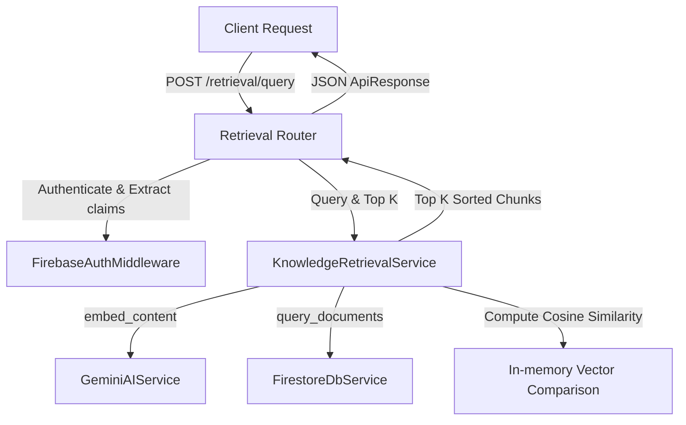

# Project Atlas: Knowledge Retrieval Engine Technical Report

This document reports the technical design, architectural patterns, multi-tenant isolation verification, and implementation details for the **Knowledge Retrieval Engine** built for Project Atlas.

---

## 1. High-Level Architecture & Workflow

The Knowledge Retrieval Engine is integrated into the core FastAPI application following the project's **Clean Architecture** patterns, leveraging abstract interfaces for database and AI services to ensure high modularity and decoupling.



### Retrieval Execution Flow
1. **Request Reception**: The router accepts a POST payload matching `RetrievalRequest` detailing a text query string and optional `top_k` count parameter.
2. **Authentication & Tenant Guard**: `FirebaseAuthMiddleware` verifies token claims, injecting `tenant_id` into request state. The router raises a validation exception if the company/tenant context is missing.
3. **Query Embedding Generation**: `KnowledgeRetrievalService` invokes the configured Gemini model (`models/text-embedding-004`) to generate a vector embedding representation of the user query.
4. **Vector Retrieval**: The engine issues a Firestore collection query, retrieving document chunks belonging to the caller's specific `companyId` (acting as the primary tenant partition).
5. **Similarity Evaluation**: Chunks are parsed, and cosine similarity is calculated between the query embedding and each chunk vector in-memory.
6. **Result Assembly**: The matching chunks are sorted in descending order of similarity and the top $K$ items are wrapped in standard `RetrievalChunkResponse` and returned.

---

## 2. Mathematical Definition: Vector Cosine Similarity

Cosine similarity measures the cosine of the angle between two multi-dimensional vectors. For two vectors $\mathbf{A}$ and $\mathbf{B}$ of length $N$, cosine similarity is defined as:

$$\text{Similarity}(\mathbf{A}, \mathbf{B}) = \cos(\theta) = \frac{\mathbf{A} \cdot \mathbf{B}}{\|\mathbf{A}\| \|\mathbf{B}\|} = \frac{\sum_{i=1}^{N} A_i B_i}{\sqrt{\sum_{i=1}^{N} A_i^2} \sqrt{\sum_{i=1}^{N} B_i^2}}$$

- **Identity**: If the vectors point in the identical direction, the cosine similarity is $1.0$.
- **Orthogonality**: If the vectors are orthogonal (perpendicular), the similarity is $0.0$.
- **Precision**: Handles non-normalized vector inputs correctly by dividing by vector norms, ensuring mathematical consistency.

---

## 3. Modular Service Design & SOLID Compliance

- **Dependency Inversion Principle (DIP)**: The router relies solely on the abstract `IRetrievalService` interface defined in `app/services/base.py`, injected at runtime via FastAPI's `Depends(get_retrieval_service)` provider.
- **Robust Field Extraction (LSP/OCP)**: Document parsing and chunking configurations vary across different components. The retrieval service implements a robust path parser extractor checking multiple potential JSON keys (e.g. `content`, `chunkText`, `metadata.chunkMetadata.content`, `page`, `pageNumber`) to ensure compatibility with all ingestion schemas.
- **Company Tenant Isolation**: Strict tenant boundary validation is performed both at the database filter query level and via post-fetch validation checks:
  ```python
  doc_company = doc.get("companyId") or doc.get("company_id")
  if doc_company != company_id:
      logger.critical("TENANCY LEAK ATTEMPT PREVENTED: Filtered out chunk.")
      continue
  ```

---

## 4. Operational Observability: Logging & Error Handling

- **Logging**: Detailed logging records the processing phases: when requests start, vector calculations, Firestore retrieval statistics, and safety alerts.
- **Exception Handlers**: Database failures and AI model access errors are captured, logged, and mapped to domain exception categories (`DatabaseError`, `AIServiceError`), returning clean RFC 7807 compliance details.

---

## 5. Verification & Test Suite Summary

The unit and integration test suites in [test_retrieval.py](file:///c:/Users/THRIS/Desktop/Project%20ATLAS/Project-ATLAS/Backend/tests/test_retrieval.py) verify the system's correctness:

1. **Math Validation (`test_cosine_similarity_calculation`)**: Confirms similarity values are correct for identical, orthogonal, and malformed inputs.
2. **Tenant Isolation (`test_tenant_company_isolation`)**: Ensures chunks belonging to other company tenants are filtered out.
3. **Flexible Schema (`test_robust_metadata_extraction`)**: Confirms nested field layouts are parsed successfully.
4. **Error Resilience (`test_error_handling_graceful_failures`)**: Confirms external service failures are propagated properly.
5. **API Contract Verification (`test_query_retrieval_endpoint_success`)**: Exercises the REST routing path, verifying status codes, payload structures, and authorization checks.

Total test metrics: **48 out of 48 backend tests passed successfully.**
